# 🚀 Social Media Backend API

A professional and scalable **REST API** built using **Node.js, Express.js, and MongoDB**. This project works as the backend system for a social media platform, providing secure user authentication and complete post management with cloud database integration through **MongoDB Atlas**.

## 🛠 Tech Stack
* **Runtime:** Node.js  
* **Framework:** Express.js  
* **Database:** MongoDB Atlas  
* **ODM:** Mongoose  
* **Security:** Bcrypt, Dotenv  
* **API Testing:** Postman 

---

##  Features

###  Secure Authentication
* **Password Hashing:** Integrated `bcrypt` pre-save hooks in the User Model to ensure plain-text passwords never touch the database.
* **Validation:** Strict schema enforcement for unique usernames, lowercase email indexing, and character length limits.
* **Session Management:** Complete Login/Logout flow with hashed credential verification.

###  Content Management (CRUD)
* Users can:
  * Create posts
  * Read posts
  * Update posts
  * Delete posts
* Supports efficient **PATCH requests** for partial updates.
* Includes strong error handling for:
  * Missing Data Check: Sends a 400 Bad Request error if you forget to type a username, email, or password.
  * Empty Update Check: Blocks requests with a 400 Bad Request if you try to update a post without sending any new data.
  * No Duplicate Emails: Stops new sign-ups with a 400 Bad Request if the email is already taken.
  * Wrong Email Check: Tells you "User not found" (400 Bad Request) if you try to log in with an unregistered email.
  * Wrong Password Check: Rejects login attempts with a 400 Bad Request if the password does not match.
  * Logout Check: Sends a 404 Not Found error if you try to log out an email that does not exist.
  * Missing Post Check: Sends a 404 Not Found error if you try to update or delete a post that does not exist.
  * Server Crash Protection: Uses try...catch loops so bad or broken Post IDs won't break your server.
  * App Error Listener: Watches the Express app constantly to catch and log hidden errors.
  * Database Safety Switch: Instantly shuts down the app if it cannot connect to your MongoDB Atlas cloud.

###  Architecture
* Built using the **MVC architecture pattern** for clean and maintainable code.
* API routes are versioned under `/api/v1/` for scalability and better project structure.

---

##  API & Database Showcases
###  User Authentication Testing (Postman)
Below are the results showing successful registration, secure login, safe logout.

  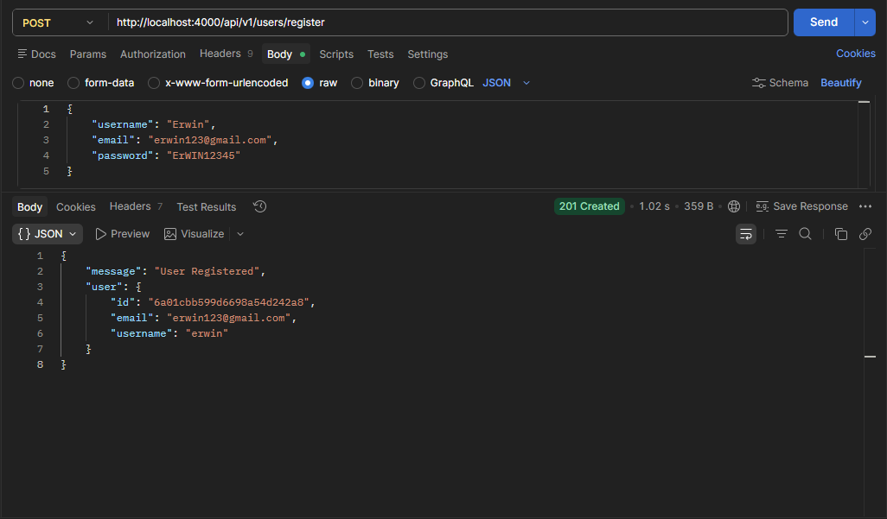
  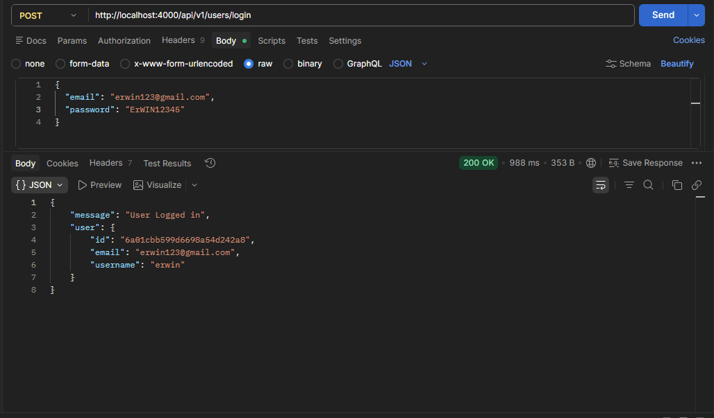
  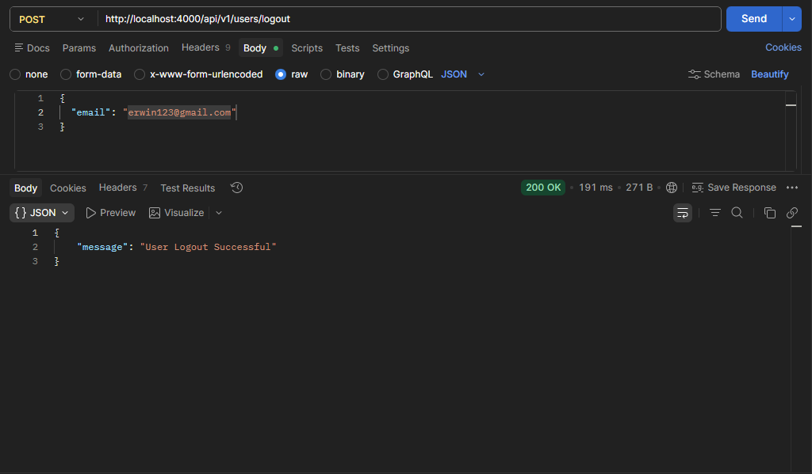

These tests demonstrate backend error validation when required details are missing or credentials are wrong.

  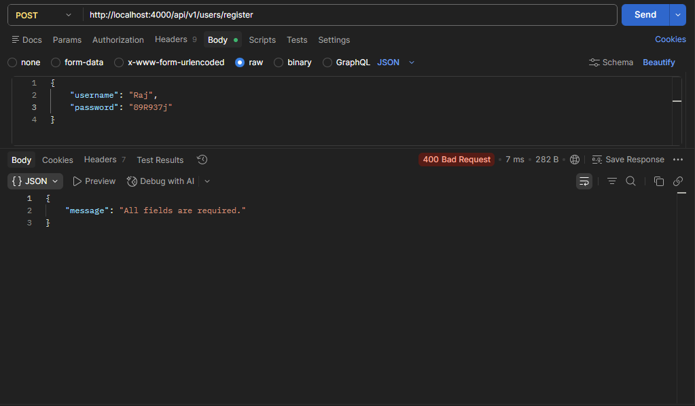
  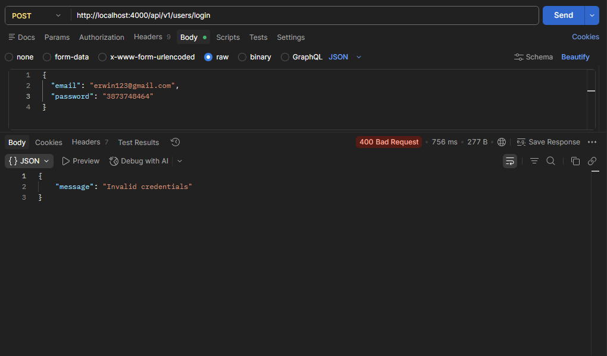

###  Post Operations Testing (Postman)
These tests demonstrate full CRUD capabilities, showcasing post creation, retrieving all available posts, updating via patches, and secure document removal.

  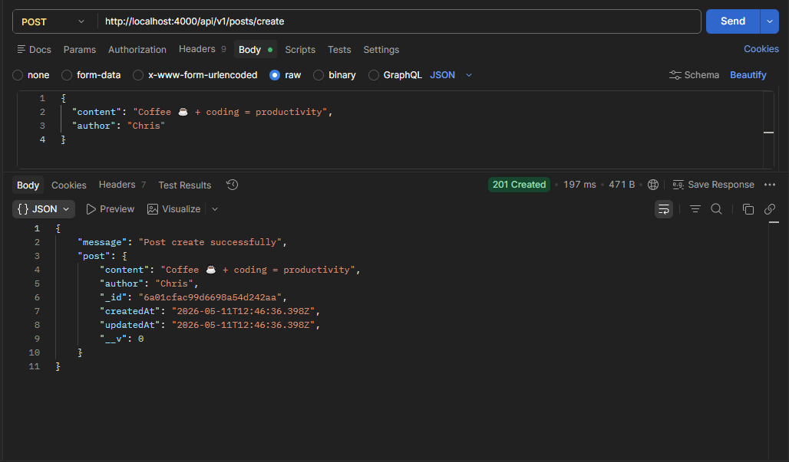
  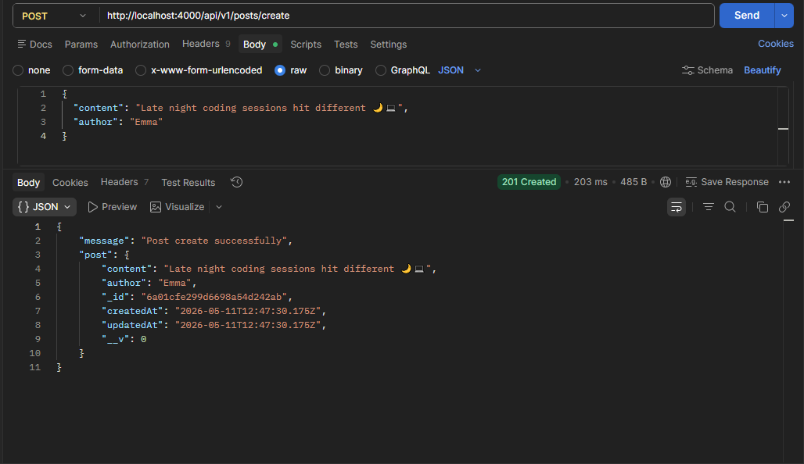
  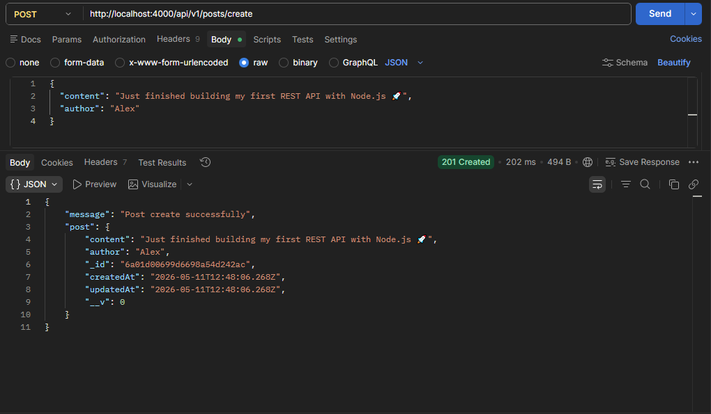
  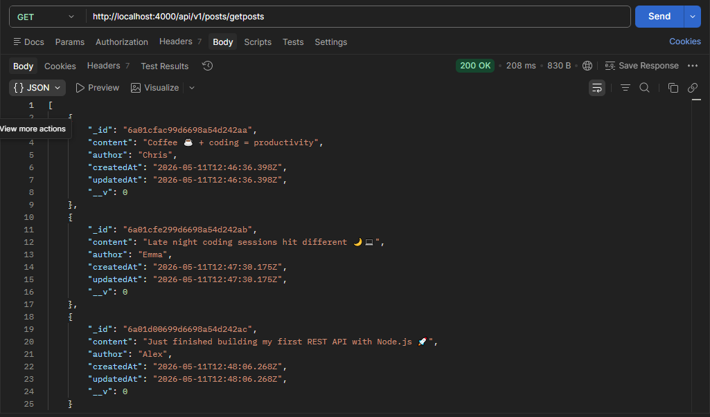

  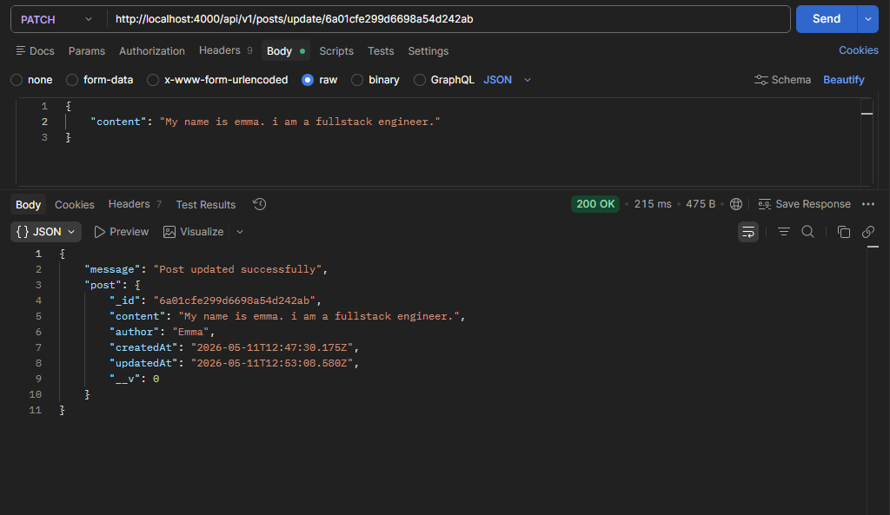
  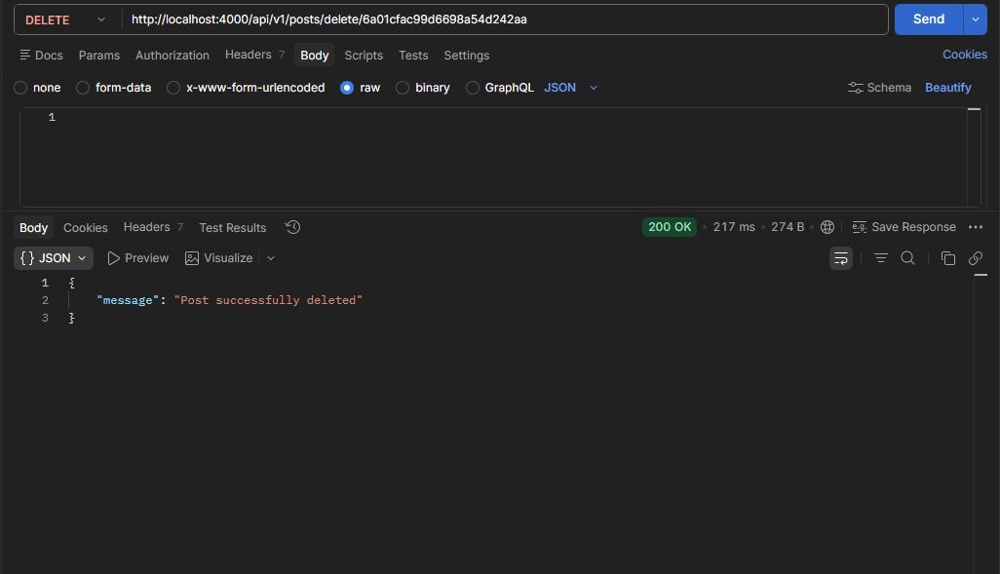

###  Database Cloud Verification (MongoDB Atlas)
Evidence of real-time cloud data storage. Notice that user passwords are completely encrypted (hashed) for security.

  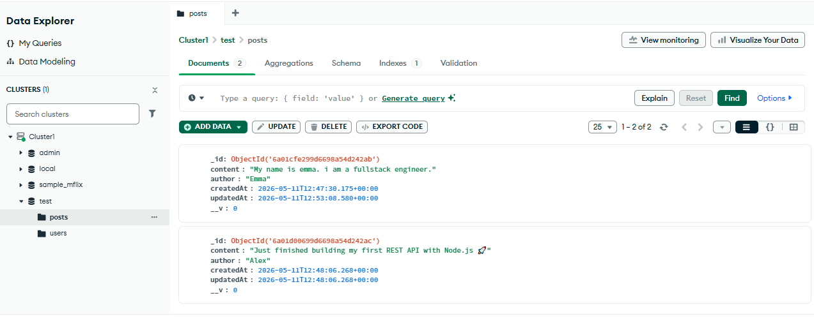
  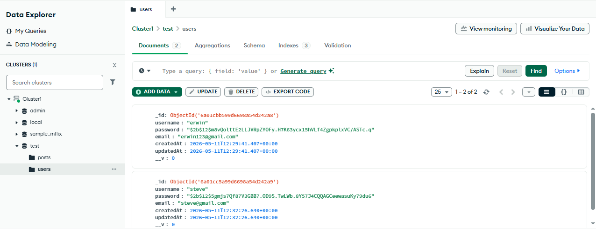

## 📁 Project Structure

  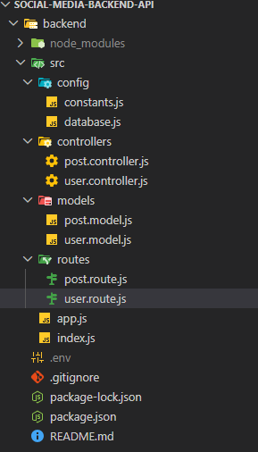

#  API Endpoints

## Authentication (`/api/v1/users`)

| Method | Endpoint     | Description                              | Status Codes |
|--------|--------------|------------------------------------------|--------------|
| POST   | `/register`  | Register a new user account              | `201 Created`, `400 Bad Request`, `500 Internal Server Error` |
| POST   | `/login`     | Login user with email and password       | `200 OK`, `400 Bad Request`, `500 Internal Server Error` |
| POST   | `/logout`    | Logout an existing user                  | `200 OK`, `404 Not Found`, `500 Internal Server Error` |

## Posts (`/api/v1/posts`)

| Method | Endpoint        | Description                           | Status Codes |
|--------|----------------|---------------------------------------|--------------|
| POST   | `/create`       | Create a new post                     | `201 Created`, `400 Bad Request`, `500 Internal Server Error` |
| GET    | `/getPosts`     | Get all available posts               | `200 OK`, `500 Internal Server Error` |
| PATCH  | `/update/:id`   | Update post content by post ID        | `200 OK`, `400 Bad Request`, `404 Not Found`, `500 Internal Server Error` |
| DELETE | `/delete/:id`   | Delete a post by post ID              | `200 OK`, `404 Not Found`, `500 Internal Server Error` |

## 👨‍💻 Developed By: Sharaf Ahmed

-  **Education:** Software Engineering Undergraduate
-  **Core Focus:** Backend Web Development & Scalable Architecture
-  **Current Stack:** Node.js | Express.js | MongoDB
